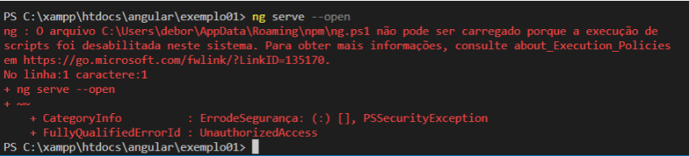

# Angular

## 1. Introdução
### 1.1 O que é Angullar?
Angular é um framework, um conjunto de ferramentas, baseada em typescript mantido pela Google.

### 1.2 Vantagens
* Estruturação em camadas bem definidas
* Permite componentes reusaveis
* Fornece forte estrutura para integrar com back-end
* Ideal para projetos de grande porte, devido a reutilização de métodos
* Foco em desenvolvimento de aplicações hibridas

### 1.3 Desvantages
* De acordo com a W3C é considerado errado vincular no HTML códigos CSS ou Javascript.
* Algumas funções Javascript ficam inutilizadas

### 1.4 AngularJS ou Angular?
AngularJS é a primeira versao do angular, baseado em javascript, a partir da segunda versão se tornou Angular baseado em typescript.

### 1.5 Softwares necessários para desenvolver Angular
<b>NodeJS : </b>É uma dependencia, criado basicamente em javascript, para poder baixar arquivos, plugins, softwares, baixar as dependencias do angular.

<b>NPM : </b>Baixa varios pacotes de dados, comprime os arquivos e faz o dowload.

### 1.6 Instalação:

Com os pré-requisitos preenchidos (node e npm) realizar a instalação através dos comandos:

    npm install -g @angular/cli

Realizar a criação do workspace do projeto, em uma pasta com caminho especifica destinada para projetos angular C:\xampp\htdocs\angular\ (Nesse exemplo foi criado na pasta do htdcos do Xampp, pois seria utilizado o PHP e banco de dados do mesmo).
Após isso criar o primeiro projeto, através do comando:

    ng new meu_projeto

Criado o projeto rodar(emular) a aplicação no servidor, por meio do comando

    ng serve --open

Caso tenha problema de acessar por meio do Powershell, com o erro abaixo, utilizar o comando informado e depois rodar o ng serve novamente:

    Set-ExecutionPolicy -ExecutionPolicy RemoteSigned -Scope CurrentUser

Se tudo estiver ok, sera aberta a aplicação no servidor em <b>localhost:4200</b>.

## 2. Estrutura do arquivo

<b>e2e: </b>Testes unitarios.
<b>node_module: </b> Todos os modulos sao colocados aqui, sao os plugins.
<b>src: </b>Principal, onde estará nossa aplicacao.
<b>src/app: </b>O index puxa os dados do app-root, que uma tag que chama um complemento.

## 3. Componentes

Localizado dentro da pasta app componente é uma pagina/parte do no site, agrupamento de arquivos, cada uma dessas paginas tem seus proprios conteúdos. Para criar um componente tem algumas formas, a mais convencional é a :

    ng g component meu-componente
    ng g c meu-componente

Assim ele vai no node baixa as configurações e cria uma nova pasta em app, com o nome do componente criado, com os arquivos HTML, CSS, TYPESCRIPT e SPEC (conversao).

No arquivo <b>TYPESCIPT</b> em <b>@component</b>, temos o seletor da minha pagina, no exemplo: <b>'app-meu-componente'</b>.

Em index.html tenho a tag <b>`<app-root></app-root>`</b>, essa tag puxa as configurações da pagina app.component.html, que nao pode ser excluida pois é a nossa pasta root, porem podemos importar as informações de outra página para essa pagina principal, chamando pelo seu @component - <b>`<app-meu-componente></app-meu-componente>`</b>

Digitamos `ng serve` para testar e ver se funciona, nesse sentido o conteudo da nossa página deverá estar puxando as informações do HTML do meu componente.

## 4. Módulos

Em app fora da pasta dos componentes criados, temos o app root, que é a estrutura principal, nesse local temos o `app.module.ts`, onde módulos, sao componentes importados para aplicação em determinada área no nosso site.

Podemos ter vários módulos, e a ideia central é a possbilididade de restringir, por exemplo, uma parte do site apenas com componentes relacionados a produtos PET, podemos separar um modulo com esses dados de produtos PET.

Carregar uma parte do site para produto de limpeza, entao a pagina que tem acesso ao modulo de produto PET, nao tem acesso ao modulo de produto de limpeza.

Nesse arquivo temos inicialmente a importacao de dois módulos nativos e os módulos criados por nós, mais o app-component.

Em `declarations` tempos acesso aos componentes importados

Em `imports` podemos importar modulos distintos, modulos complementares do angular.

Em `providers`, temos outros componentes, como bootstrap, googlemaps.

## 5. Diretivas
São acões como exibir informacao, remover, trabalhar com texto ... é a interacao entre a aplicação e o cliente. Quando quermos manipular a página, deixar elas mais intuitivas vamos utilizar as diretivas.

Temos o:
- `ng if` - condicional
- `ng for` - laco de repeticao
- `ng swich` - escolha caso

### ngIf:
Util para acoes como exibir ou ocultar elementos, ou coisas do tipo

Obs - em caso de erro de declaracao da variavel:
 - https://cursos.alura.com.br/forum/topico-erro-declaracao-de-variavel-161945

Utilizamos: `"strictPropertyInitialization": false` em `tsconfig.json`

Exemplo NgIf
Em componente.ts, montamos a estrutura:

    //Diretiva NGIF
    exibirTexto:boolean;

    acaoNgIf(){
        this.exibirTexto = !this.exibirTexto;
    }

Em componente.html, chamamos a estrutura:

    
Aplcicando NgIf

    <input type="button" value="Enviar" (click)="this.acaoNgIf()">
    <h1 *ngIf="this.exibirTexto">Aprendendo Angular</h1>

Nesse exemplo utilizamos o ngIf para validar se o botao foi pressionado, se a variavel boolean é verdadeira fazendo com que o texto seja mostrado ou não.

### ngFor:
É uma diretiva com laco de repetição

Exemplo NgFor
Em componente.ts, montamos a estrutura de um array por exemplo:

    // Diretiva NGFOR
    cursos = ["HTML", "CSS", "PHP", "ANGULAR"]

Em componente.html, chamamos a estrutura utilizando um laco para passar pelos valores do nosso vetor:

    
Aplcicando NgFor

    <ul *ngFor="let curso of cursos; let indice = index">
        <li>{{indice + 1}} {{curso}}</li>
    </ul>

Assim conseguimos criar um lista em nossa página, utilizando o NgFor.

### ngSwitch:
É a diretiva de escolha caso.

Exemplo NgSwitch
Em componente.ts, montamos a estrutura de um array por exemplo:

    // Diretiva NGSWITCH
    cursos = ["HTML", "CSS", "PHP", "ANGULAR"]
    curso_selecionado = "ANGULAR";

Em componente.html, nesse caso utilizaremos um <b>bind</b>, onde iremos mandar para o HTML e informação do arquivo.ts:

    
Aplcicando NgSwitch

    

        
HTML

        
CSS

        
PHP

        
ANGULAR

    

Nesse caso estamos pedindo para o Angular exibir no nosso HTML apenas o curso selecionado na minha variavel.

### ngClass
Trabalha com nossas classes, podendo utilizar CSS.

Exemplo NgClass
Em componente.ts, montamos a estrutura por exemplo:

    //Diretiva NGCLASS
    ligada:boolean;

    ligarNgIf(){
        this.ligada = !this.ligada;
    }

Em componente.html, criamos nossa aplicação:

    
Aplcicando NgClass

    

    <button type="button" (click)="this.ligarNgIf()" >Ligar/Desligar</button>
    <h1 [ngClass]="{'ligada':ligada, 'desligada':!ligada}">Lampada</h1>

Sempre que nossa variavel ligado for falso, ele acionará a classe desligada e mudara a cor do texto para vermelho e vice-versa.

## 6. Bind (DataBind)

Temos varios tipos de bind para enviar informações, mas o conceito inicial é:
 * Pegar o dado do componente e enviar para o componente html (o arquivo.ts enviando para arquivo.html), podendo ser uma variavel. Sempre que quero transferir esse dado do arquivo ts, em app component, e enviar para o html, abro duas chaves no html e coloco a variavel. Exemplo:

No arquivo.ts

    export class AppComponent {
        //Criar variaveis

        valor1:number = 1;
        valor2:number = 10;
    }

No arquivo.html

    

    <h2>{{valor1 + valor2}}</h2>

 ### Event Bind
 São funcões que são criadas no arquivo.ts e podem ser acessadas atraves do html.

No arquivo.ts:

    export class AppComponent {
        //Funcão de clique - Eventos

        mensagem(){
        window.alert("Este é um exemplo de EventBind")
        }
    }

No arquivo.html:

    <button (click)="mensagem()">Clique aqui</button>

### Two Way DataBind
É quando o arquivo html tbm consegue enviar dados para o arquivo.ts, é uma ponte de via dupla.

Para isso, primeiro precisamos importar um componente chamado forms model, que importamos em <b>app.module.ts</b>:

    import { FormsModule } from '@angular/forms';
    
E chamando no <b>imports</b>, ficando dessa forma.

    @NgModule({
        declarations: [
            AppComponent
        ],
        imports: [
            BrowserModule,
            FormsModule
        ],
        providers: [],
            bootstrap: [AppComponent]
    })

Para chamar um twoWay dataBind este é a forma:

No arquivo.ts, crio uma variavel, onde posso ou não atribuir valor

    export class AppComponent {
        // TwoWay DataBind
            nome2:string = "";
    }

No arquivo.html, chamo o ngModel, com a variavel, assim como tenho um input, assim que eu digitar um nome, esse valor será atribuido a minha variavel.

    <h1 style="color:red">TwoWay DataBind</h1>

    <input type="text" [(ngModel)]="nome2">
    <h2>O nome digitado foi {{nome2}}</h2>

### TwoWay data bind + Orientacao a objeto

Em um formulario grande por exemplo, faz-se necessário a utilização de um objeto (POO), que facilita e deixa mais organizado nosso código.

Assim no arquivo.ts, podemos criar nosso objeto

    export class AppComponent {
        // TwoWay DataBind + Orientacao a Objeto

        pessoa:any={
            nome:"Lucas",
            idade:27,
            cidade:"Piracicaba"
        };
    }

Para trabalhar com o objeto, no arquivo.html, chamamos nosso NgModel, e podemos assim alterar essas elementos do nosso objeto, e posteriormente, utilizar esses dados para alimentar um banco de dados, por exemplo.

    <h1 style="color:red">TwoWay DataBind + Orientacao a Objeto</h1>

    <input type="text" [(ngModel)]="pessoa.nome">
    <input type="text" [(ngModel)]="pessoa.idade">
    <input type="text" [(ngModel)]="pessoa.cidade">

    <h2>O {{pessoa.nome}} tem {{pessoa.idade}} e mora em {{pessoa.cidade}}</h2>

## 7. Templates

Templates são páginas, eu posso querer que a pagina aparece ou desapareca de acordo com alguma acao.
São subestruturas dentro do nosso site.

Para implementar um Template, vamos criar uma estrutura para alterar a página que esta sendo exibida, assim em arquivo.ts, nesse caso se for true a página exibida será a página 1, se não for true, será exibida a página 2.

    export class AppComponent {
  
        //Variavel da pagina 1
        p1:boolean = true;

        //Funcao para alterar a pagina
        alterarPagina(){
            this.p1 = !this.p1;
        }
    }

Por sua vez no arquivo.html

    <!-- Selecao da pagina -->
    

    <!-- Quebra de linha -->
    

    <!-- Seletor de Paginas -->
    <button (click)="alterarPagina()">Alterar Pagina</button>

    <!-- Templates -->
    <ng-template #pagina1>Pagina 01</ng-template>
    <ng-template #pagina2>Pagina 02</ng-template>

A diferenca dessas páginas, é o carregamento em tempo real, não tem o load. É muito rapido o carregamento, assim podemos ter vários templates e criar de acordo com nossa necessidade diversas subestruturas.

## 8. Pipes (Tubos)

O Pipe nada mais é que uma máscara, que transforma o texto ou número/datas. Por exemplo, eu querer que todos os nomes da minha página, tenha letras maíusculas ou letras minusculas, em arquivo.html:

    <h1>Pipe - mascara</h1>

    <h2>{{nome | uppercase}}</h2>
    <h2>{{nome | lowercase}}</h2>

Existe diversas possibilidades de utilização dos Pipes. Para ver alguns exemplos de pipe: https://angular.io/guide/pipes.

É possivel customizar o pipe tambem, por exemplo, intercalar entre letras maiusculas e minusculas. Podemos criar nosso proprio customizador com o Pipe.

## 8. Servicos - (projeto CRUD)

A ideia central é que coloquemos as ações do nosso sistema em servicos. Temos normalmente o component.ts, que na verdade nao é onde cria o servico, na verdade ele serve para intermediar a comunicacao entre o servico e o HTML. Entao por questao de boa pratica nao criamos o servico dentro componente.ts

Para entendermos melhor como funciona os servicos na prática, iremos criar um CRUD, utilizando a classe de cursos. Então primeiramente criamos, nosso projeto, em <b>app.component.ts</b> apagamos a variavel <b>title</b>, pois não será utilizada e criamos o novo componente, <b>cursos</b>:

    ng g c cursos

Assim dentro da pasta app, tera uma nova cursos que tera seus próprios arquivos arquivos. Agora criamos um <b>servico</b> dentro da pasta cursos criada anteriormente:

    ng g s cursos/cursos

Assim é criado um novo arquivo dentro da pasta de cursos chamado - <b>cursos.service.ts</b>
Aqui dentro ficara toda a estrutura para manipular cursos

É possivel observar que ja ha a importacao de um `Injectable`, que nada mais significa que ele tera acesso ao componente.
Por padrao ele vem root, que significa qualquer componente tera acesso a esse servicos, mas se quiser que o service funcione apenas para o componente cursos, mudamos de root, para Cursos, não faremos isso nesse exemplo.

Temos entao uma classe e dentro dela o nosso construtor, que basicamente é sempre que acessarmos a página, será executada uma ação padrão inicial. Dentro dessa classe que criamos também nossas demais ações, nesse exemplo: <b>Criação do Vetor, Cadastro, Alteração, Seleção, Exclusão</b>.

Para facilitar trabalhar com nosso cursos cadastrados, que serão nosso objeto, tendo suas próprias caracteristicas, iremos criar uma classe para servir de <b>Molde ou Modelo</b>.

Assim criamos um novo arquivo chamado <b>Curso.ts</b>. Nesse arquivo teremos uma classe, onde todo curso terá seus atributos. Criando esse modelo, que será base para trabalhar com nossos Cursos.

    //Classe
    export class Curso{
    
        //Atributos
        public nomeCurso:string;
        public valorCurso:number;
        public areaCurso:string;

        //Construtor
        constructor(nome:string, valor:number, area:string){
            this.nomeCurso = nome;
            this.valorCurso = valor;
            this.areaCurso = area
        }
    }

Agora com nosso modelo criado, vamos voltar para nosso service.ts e criar nosso vetor de Cursos, para que possamos armazenar nossos cursos.

    //Vetor de cursos
    // criei o vetor com base no construtor feito na classe Curso, assim temos que importar nossa classe.

    private vetorCursos: Curso[] = [

    new Curso("Angular", 800, "Desenvolvimento"),
    new Curso("PHP", 590, "Desenvolvimento"),
    new Curso("Photoshp", 470, "Design")

    ];

Agora iremos criar as funções de cadastramento de cursos e listagem

    // CAdastro de cursos
    // pego o vetor de curso e dou um push, com o novo curso, baseado no construtor da classe Cursos

    public cadastrar(curso:Curso){
        this.vetorCursos.push(curso);
    }

    //Selecao de cursos
    //so preciso retornar o vetor de cursos
    public listar(){
        return this.vetorCursos;
    }

Agora criaremos o servico para alterar nosso curso, cadastrado. Basicamente ele seleciona o Curso de acordo com o id, e passa um novo valor para o objeto curso.

    //Alteracao de cursos
    //Preciso do id e do curso, e a alteracao sera de acordo coma informacao de curso, entao como parametros terei esse id, e o objeto curso que pertence a classe Curso.

    public alterar(id:number, curso:Curso){
        this.vetorCursos[id] = curso;
    }

Por fim temos a nossa exclusão:

    //Exclusao de cursos
    // So preico do id para exclusao, e irei pegar o vetor de cursos, e fazer um splice pelo id, e a partir dele 1 linha

    public excluir(id:number){
        this.vetorCursos.splice(id,1);
    }

Com os nossos servicos criados, passamos agora para trabalhar com nosso componente.ts, criamos os parametros iniciais para termos acesso aos métodos e atributos do nosso servico:

    export class CursosComponent implements OnInit {

        //Atributos
        public vetorCursos:Curso[];
        public curso:Curso;
        public id:number;

        // Construtor - como quero ter acesso ao meu servico, crio um parametro para poder utilizar
        //para termos acesso aos metodos e atributos que temos no servico.ts

        constructor(private servico:CursosService) { }

Agora antes de dar continuidade os componentes vou para meu arquivo.html criar a estrutura, que basicamente será uma tabela com nossos atributos dos cursos e formulários para podermos vincular as funções de interação entre nosso html e componente.

O resultado final do html, já com as chamadas para as funções do componente, ficará assim:

    <!-- Formulario -->

    <form action="">
        <input type="text" placeholder="Curso" [(ngModel)]="curso.nomeCurso" name="nomeCurso">

        <input type="number" name="" id="" placeholder="Valor" [(ngModel)]="curso.valorCurso" name="valorCurso">

        <input type="text" placeholder="Area" [(ngModel)]="curso.areaCurso" name="areaCurso">

        <input type="button" value="Cadastrar" (click)="cadastrar()" *ngIf="id<0">

        <input type="button" value="Confirmar Edição" *ngIf="id>=0" (click)="atualizar()">
    </form>

    <!-- Tabela -->
    <table>
        <thead>
            <th>Curso</th>
            <th>Valor</th>
            <th>Area</th>
            <th>Acoes</th>
        </thead>

        <tr *ngFor="let curso of vetorCursos; let id=index">
            <td>{{curso.nomeCurso}}</td>
            <td>{{curso.valorCurso}}</td>
            <td>{{curso.areaCurso}}</td>
            <td>
                <button class="excluir" (click)="excluir(id)">Excluir</button>
                <button class="alterar" (click)="editar(id)">Alterar</button>
            </td>
        </tr>
    </table>

Também estilizamos nossa tabela, através do CSS.

    
    * {
        font-family: Arial, Helvetica, sans-serif;
    }

    form{

        width: 800px;
        margin: 30px auto;
        border: 1px solid #ccc;
        background-color: #e8e8e8;
        border-radius: 5px;
        padding: 5px;
    }

    input[type="text"],input[type="number"]{
        border-radius: 5px;
        padding: 5px;
        border: 1px solid #ccc;
        margin-right: 10px;
        width: 193px;
    }

    input[type="button"]{
        background-color: #09aa03;
        border-radius: 5px;
        padding: 5px;
        border: 1px solid rgb(19, 160, 0);
        color: #fff;
        width: 150px;
    }

    table{
        width: 800px;
        margin: 30px auto;
        border: 1px solid #ccc;
        background-color: #e8e8e8;
        border-radius: 5px;
        padding: 5px;
    }

    table td {
        border-bottom: 1.5px dashed rgb(158, 154, 154);
        border-right: 1.5px dashed rgb(158, 154, 154);
        padding: 5px;
    }

    .excluir {
        background-color: rgb(241, 33, 33);
        color: #fff;
        padding: 5px;
        border-radius: 5px;
        border: 1px solid rgb(241, 33, 33);
        margin-left: 10px;
        width: 45%;
    }

    .excluir:hover{
        background-color: rgb(182, 19, 19);
        border: 1px solid rgb(182, 19, 19);
    }

    .alterar {
        background-color: rgb(250, 167, 12);
        color: #fff;
        padding: 5px;
        border-radius: 5px;
        border: 1px solid rgb(220, 241, 33);
        margin-left: 10px;
        width: 45%;
    }

    .alterar:hover{
        background-color: rgb(182, 166, 19);
        border: 1px solid rgb(182, 166, 19);
    }

    th {
        padding-bottom: 5px;
        padding-top: 5px;
        border-bottom: 2px solid rgb(158, 154, 154);
        border-top: 2px solid rgb(158, 154, 154);
        color: rgb(26, 25, 25);
    }

Após a criação da nossa estrutura e estilização vamos apresentar as funções criadas em component.ts para interagor com nosso HTML.

<b>Listar Cursos</b>

    // inicialização - inicializacao padrao quando aberto

    ngOnInit(): void {
        this.id = -1;
        this.curso = new Curso("",NaN,"");
        this.vetorCursos = this.servico.listar();
    }

<b>Cadastramento de Cursos</b>
Como vamos trabalhar com twoWays dataBind, temos que importar o `Forms Module`

    //Cadastrar

     cadastrar(){
        this.servico.cadastrar(this.curso);
        this.curso = new Curso("",NaN,"");
    }

<b>Exclusao de cursos</b>

    //Exclusao
    excluir(id:number){
        this.servico.excluir(id);
        this.id = -1;
        this.curso = new Curso("",NaN,"");
    }

<b>Alteração de Cursos</b>

    //Editar
    editar(id:number){

        this.id = id;

        this.curso = new Curso(
            this.vetorCursos[id].nomeCurso,
            this.vetorCursos[id].valorCurso,
            this.vetorCursos[id].areaCurso,
        );
    }

<b>Atualizar (após edição)</b>

     //Atualizar
    atualizar(){
        this.servico.alterar(this.id, this.curso);
        this.curso = new Curso("",NaN,"");
        this.id = -1;
    }

## 9. Rotas
Rota é um carregamento dinamico de paginas, quando estamos em uma ágina e essa pagina tem um link, esperamos para carregar aquela pagina. Rotas, executa uma pagina, mas nao existem um load, abre a pagina automaticamente, sem precisar carregar novamente a pagina. Isso faz com que a aplicação fique mais rapida.

Para inciar o estudo de rotas, precisamos ter paginas para navegacao, entao para isso iremos criar as paginas atraves dos comandos

    ng g c home
    ng g c sobre

Agora que temos nossas duas paginas criadas temos que realizar a interligação entre elas, que se trata da implementacao da nossa rota. Iremos startar nosso servidor

    ng s

Vamos agora mudar essa visualização do welcome do nosso app.component.html

Observe que agora la no final temos um novo componente `<router-outlet></router-outlet>` que é a exibicao dos meus componentes, iremos manter e apagar o restante, ali dentro sera exibido o meu sobre ou o meu home.

Juntamente com esse componente , podemos criar nossa barra de navegacao

Exemplo:

    <!-- Menu -->
    <nav>
        <a routerLink="/home">Home</a>
        <a routerLink="/sobre">Sobre</a>
    </nav>

    <!-- Exibir os componentes -->
    <router-outlet></router-outlet>

E agora vamos implementar a rota, indo em <b>app-routing.module.ts</b>, na constante de rotas criamos a implementacao

    const routes: Routes = [
        { path: 'home', component: HomeComponent },
        { path: 'sobre', component: SobreComponent }
    ];

Agora se testarmos conseguimos ver que se tornou possivel a navegacao entre home e sobre.

### Implementando uma rota padrao

É possivel estabelecer uma rota padrao, criando um path vazio, e utilizando a funcao redirectTo, para o caminho padrao, como pathMatch:'full', para que isso seja feito sempre nessa situação.

    { path: '', redirectTo: 'home', pathMatch:'full'}

### Rotas de erro
Para criar uma rota de erro devemos criar um novo componente, criando um pagina para ser rediriecionada em caso de erro.

    ng g c error404

Com a pagina criada vamos ao HTML da mesma e criar uma visualização informando que a pagina nao foi encontrada.
E apos isso criamos a rota para redirecionar em caso de erro

    {path: '**', component: Error404Component}

### Funcao Guard
Serve para salvar a as rotas e protege-las contra acessos indevidos, como por exemplo impedir que alguem acesse a pegina sem ter feito o devido login.

Criamos um funcao que caso seja true ou false, temos acesso liberado a pagina sobre ou nao

Vamos primeiro criar o nosso guard... nossa autenticação

    ng g g Auth

Posso selecionar o tipo de autenticacao que quero implementar, vou selecionar o CanActivate

Cria-se o nosso <b>auth.guard.ts</b>, no app root. Vamos para o nosso app routing e selecionamos qual das nossas rotas estara assegurada pelo AuthGuard.

    { path: 'sobre', component: SobreComponent, canActivate:[AuthGuard] }

Assim definimos que esta pagina que queremos ter uma seguranca, e so sera acessada em caso de algum tipo de verificação

Agora vamos criar um boolean la em auth.guard para validar esses acesso

    export class AuthGuard implements CanActivate {

        //Variavel de acesso
        acesso:boolean=false;

        //Metodo
        canActivate(
            route: ActivatedRouteSnapshot,
            state: RouterStateSnapshot): Observable<boolean | UrlTree> | Promise<boolean | UrlTree> | boolean | UrlTree 

            return this.acesso;
    }
    

  ## 10. Implementando Bootstrap

  Para implementar o bootstrap no angular devemos fazer a instalaçao do mesmo, pelo npm

    npm i bootstrap

  Apos instalado sera criada uma psta em node modules com o bootstrap.

  agora em angular.json, vamos na configuração de estilos, a inserir o boostrap: 

    "styles":[
        "node_modules/bootstrap/dist/css/bootstrap.min.css",

        "src/styles.css"
    ]

para trabalhar com bootsrap esapecifico para angular, temos o site:

* https://ng-bootstrap.github.io/#/home
* https://angular.io/

Estudar o modulo HTTP

Outras fontes:
https://jacksongomesbr.gitbooks.io/desenvolvimento-web-front-end-com-angular/content/
